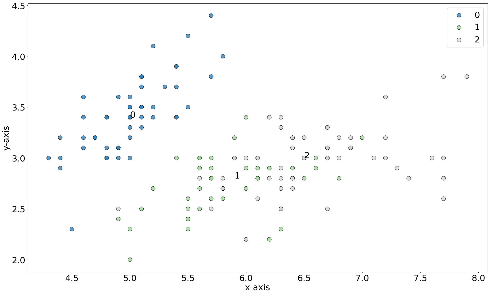
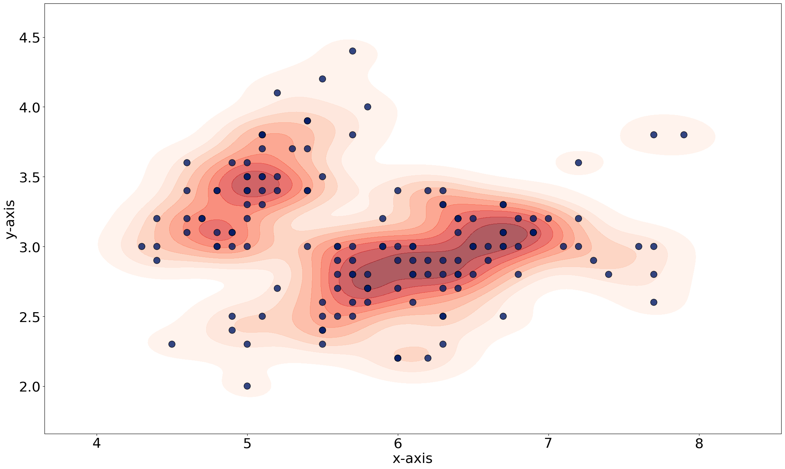
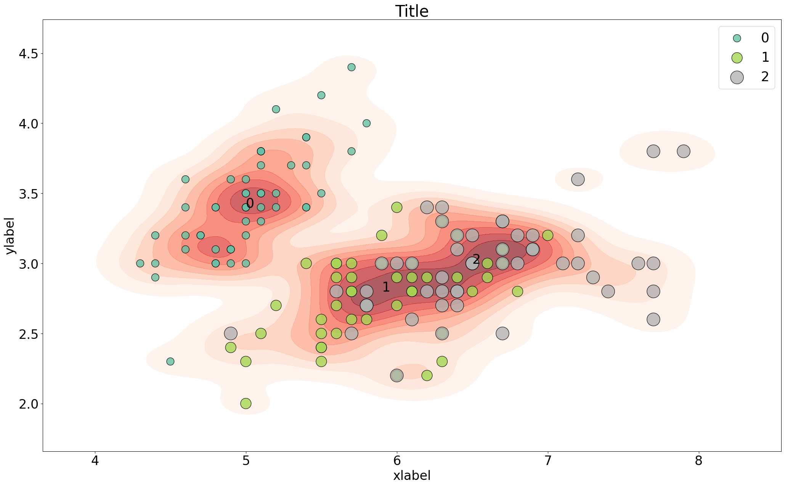
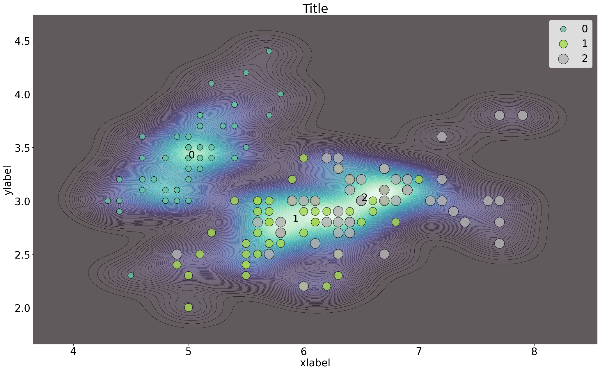

.. include:: add_top.add

Quick Scatter
####################################

In the following example we will make a simple scatter plot using all default parameters.

.. code:: python
	
	# Import example iris dataet
	from sklearn import datasets
	iris = datasets.load_iris()
	X = iris.data[:, :2]
	labels = iris.target

	# Load library
	from scatterd import scatterd
	
	# Scatter the results
	fig, ax = scatterd(X[:,0], X[:,1])

.. |fig1| image:: ../figs/fig1_simple.png

.. table:: Basic scatterplot
   :align: center

   +----------+
   | |fig1|   |
   +----------+

Coloring Dots
####################################

Coloring the dots can using RGB values or standard strings, such as 'r', 'k' etc

.. code:: python
	
	# Color dots in red
	fig, ax = scatterd(X[:,0], X[:,1], c=[1,0,0])

.. |fig2| image:: ../figs/fig2_red.png

.. table:: Red dots
   :align: center

   +----------+
   | |fig2|   |
   +----------+

Coloring Class Label Fonts
####################################

Coloring the dots can using RGB values or standard strings, such as 'r', 'k' etc

.. code:: python
	
	# Fontcolor in red
	fig, ax = scatterd(X[:,0], X[:,1], fontcolor=[1,0,0])

	# Fontcolor red
	fig, ax = scatterd(X[:,0], X[:,1], fontcolor='r')

.. |fig3| image:: ../figs/fig1_fontcoloring.png

.. table:: Class label coloring
   :align: center

   +----------+
   | |fig3|   |
   +----------+

Coloring on classlabels
####################################

Coloring the dots on the input class labels.

.. code:: python
	
	# Color on classlabels
	fig, ax = scatterd(X[:,0], X[:,1], labels=labels)

	# Change color using the cmap
	fig, ax = scatterd(X[:,0], X[:,1], labels=labels, cmap='Set2')

.. table:: Class label coloring
   :align: center

   +----------+
   | |fig4|   |
   +----------+
   | |fig5|   |
   +----------+

Overlay with Kernel Density
####################################

Overlay the scatterplot with kernel densities.

.. code:: python
	
	# Add density to plot
	fig, ax = scatterd(X[:,0], X[:,1], density=True)

	# Color the classlabels
	fig, ax = scatterd(X[:,0], X[:,1], labels=labels, density=True)

	# Increase dot sizes
	fig, ax = scatterd(X[:,0], X[:,1], labels=labels, density=True, s=100)
	
	# Change various parameters
	fig, ax = scatterd(X[:,0], X[:,1], labels=labels, s=s, cmap='Set2', xlabel='xlabel', ylabel='ylabel', title='Title', fontsize=25, density=True, fontcolor=[0,0,0])

.. |fig7| image:: ../figs/fig_density_2.png
.. |fig8| image:: ../figs/fig_density_3.png

.. table:: Class label coloring
   :align: center

   +----------+
   | |fig6|   |
   +----------+
   | |fig7|   |
   +----------+
   | |fig8|   |
   +----------+
   | |fig9|   |
   +----------+

Customized colormap
####################################

Overlay the scatterplot with kernel densities.

.. code:: python
	
	# Change various parameters
	args_density = {'fill':True, 'thresh': 0, 'levels': 100, 'cmap':"mako"}

	# Scatter
	fig, ax = scatterd(X[:,0], X[:,1], labels=labels, s=s, cmap='Set2', xlabel='xlabel', ylabel='ylabel', title='Title', fontsize=25, density=True, fontcolor=[0,0,0], axiscolor=None, args_density=args_density)

.. table:: Custom colormap
   :align: center

   +----------+
   | |fig10|  |
   +----------+

.. include:: add_bottom.add